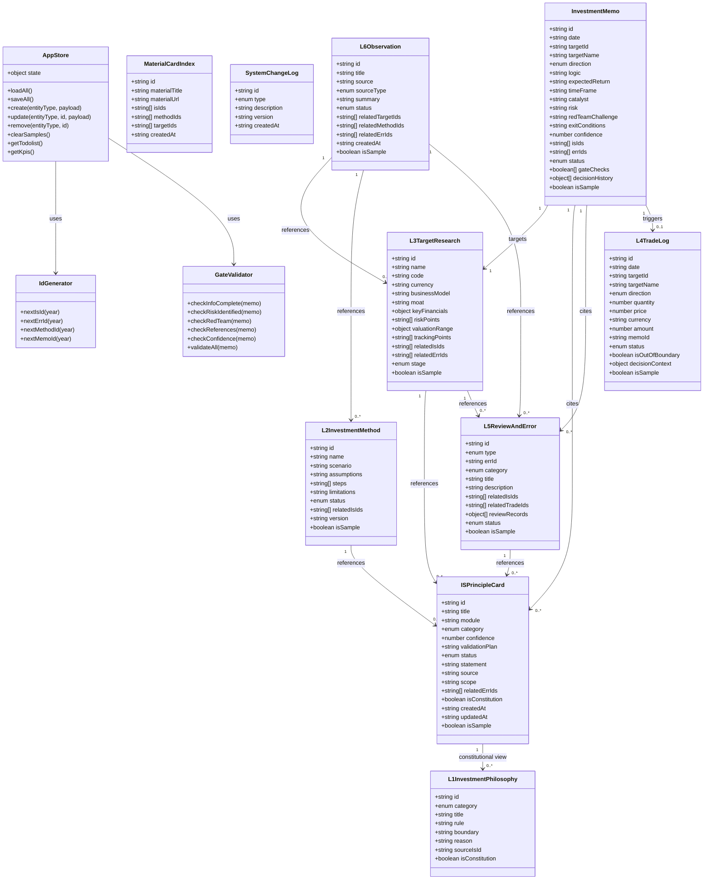
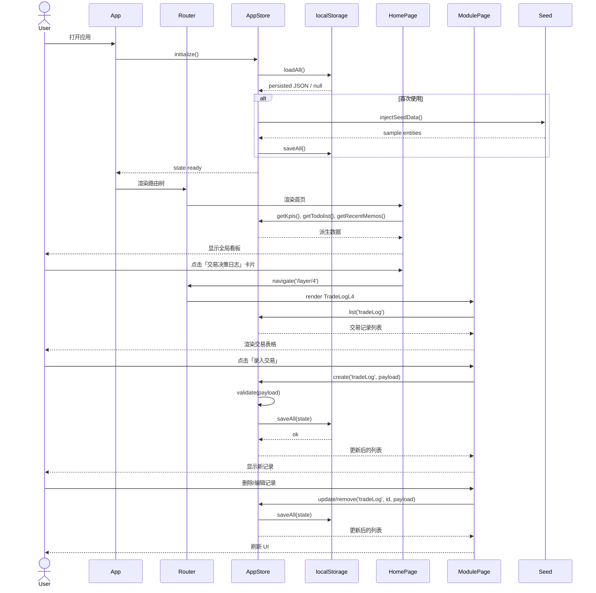
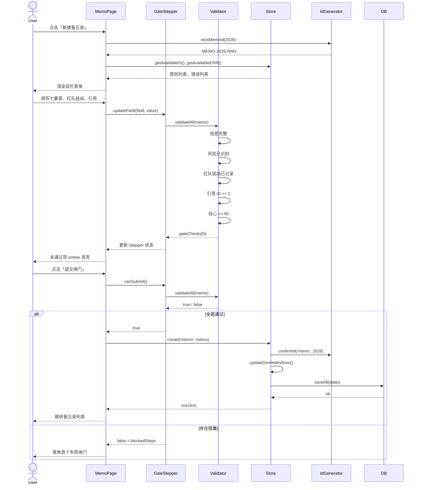
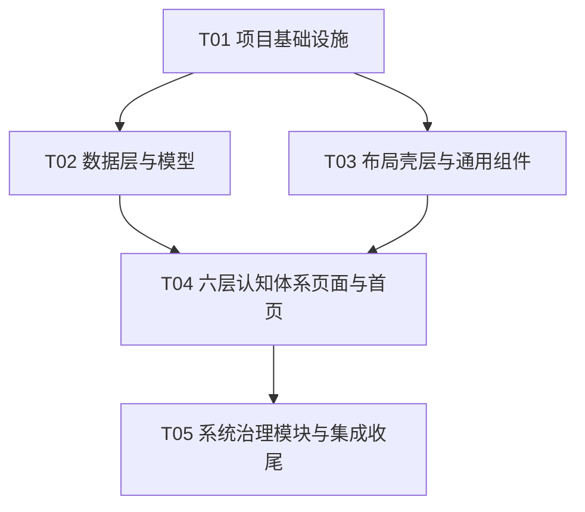

# 认知投资工作台 · 系统架构设计

> 项目名：`cognitive_investment_workbench`  
> 版本：MVP v1.0  
> 日期：2026-08-21  
> 技术栈：Vite + React + MUI + Tailwind CSS  
> 架构约束：纯前端、无后端、localStorage 持久化

---

## 1. 实现方案与框架选型

### 1.1 核心挑战

| 挑战 | 说明 | 应对策略 |
|---|---|---|
| 六层认知体系 + 系统治理模块独立呈现 | 11 个 MVP 模块需独立路由、独立数据表、独立 UI，但共享设计 Token 与壳层 | 按模块拆分页面组件，统一布局壳层与状态仓库 |
| 本地化样式严格（涨红跌绿 / ¥ / YYYY-MM-DD） | 金融语义与中国市场惯例强绑定 | 统一 `formatters.js`，金融色值映射到 Tailwind/MUI Token |
| 决策前闸门硬阻塞 | 备忘录 5 步闸门未通过时不允许提交 | 前端校验器 + UI Stepper 状态联动，提交按钮禁用 |
| 引用编号体系（IS/ERR/M/MEMO） | 需稳定 ID、可视化徽章、跨表关联 | 统一 ID 生成器 + `IdBadge` 组件 |
| 无后端持久化 | 所有数据落 localStorage，需考虑种子数据、清空示例、版本迁移 | 数据层抽象 `db.js`，初始化时注入种子数据并标记 `isSample` |
| AI 仅辅助不越权 | 交易只能人工录入、每屏底部必须有免责声明 | 交易页禁用 AI 入口、整宽边界红线提示条、DisclaimerBar 全局组件 |

### 1.2 技术选型与理由

| 层 | 选型 | 版本建议 | 理由 |
|---|---|---|---|
| 构建工具 | Vite | ^5.0.0 | 快速 HMR、ESM 原生、配置简洁 |
| 前端框架 | React | ^18.2.0 | 组件化、Hooks、生态成熟 |
| 路由 | react-router-dom | ^6.20.0 | 六层模块独立页面、嵌套路由、URL 可分享 |
| UI 组件库 | @mui/material | ^5.14.0 | 表格、表单、Stepper、Dialog、Chip 等基础组件开箱即用 |
| 样式原子化 | Tailwind CSS | ^3.4.0 | 设计 Token 快速映射、响应式布局、避免重复 CSS |
| 状态管理 | Zustand | ^4.4.0 | 体量小、无 Provider 嵌套、配合 `persist` 中间件直接落 localStorage |
| 日期处理 | date-fns | ^2.30.0 | 统一 `YYYY-MM-DD` 格式化、树摇友好 |
| ID 生成 | nanoid | ^5.0.0 | 内部实体唯一标识；业务编号（IS/ERR/M/MEMO）走自增计数器 |
| 图标 | lucide-react | ^0.294.0 | 矢量图标、零 emoji、与 MUI 可互补 |
| 字体 | Google Fonts | — | Noto Sans SC + Roboto Mono，在 `index.html` 引入 |

### 1.3 架构模式

- **表现层**：React 函数组件 + Hooks，页面按模块拆分 `src/pages/`，复用组件放 `src/components/` 与 `src/layout/`。
- **状态层**：Zustand `useStore` 单一仓库，按实体切片（`principles`, `methods`, `targets`, `trades`, `reviews`, `observations`, `memos`, `logs`），所有写操作经 store 完成。
- **数据层**：`src/store/db.js` 封装 `localStorage` 读写，提供版本前缀、序列化、错误兜底、`isSample` 标记；`seed.js` 负责冷启动数据注入。
- **模型层**：`src/models/schemas.js` 定义 10 张表的 TypeScript-like 接口与默认值；`idGenerator.js` 实现 IS/ERR/M/MEMO 编号规则。
- **工具层**：`formatters.js`（日期/货币/涨跌色）、`validators.js`（闸门校验、仓位硬规则）。

### 1.4 设计 Token 落地

`src/theme/tokens.js` 为唯一 Token 源，导出 24 个变量：

```js
export const tokens = {
  bgPage: '#F4F6FB',
  surface: '#FFFFFF',
  ink900: '#111827',
  ink700: '#374151',
  ink500: '#6B7280',
  ink400: '#9CA3AF',
  border: '#E5E7EB',
  primary: '#2F54EB',
  primarySoft: '#EEF1FB',
  ai: '#0EA5A4',
  aiSoft: '#E6F7F6',
  warn: '#F5A524',
  warnSoft: '#FFF6E5',
  up: '#E5484D',
  down: '#15803D',
  radius: { sm: 4, md: 8, lg: 12, xl: 16 },
  gap: { md: 16, lg: 24 },
  pad: { md: 16, lg: 24 },
};
```

**Tailwind 主题**：在 `tailwind.config.js` 的 `extend.colors` 中注册 `primary`, `ai`, `warn`, `up`, `down`, `bgPage`, `surface`, `ink` 系列，使原子类与 Token 同源。

**MUI 主题**：在 `src/theme/muiTheme.js` 中创建 `createTheme`，将 `palette.primary.main` 设为 `#2F54EB`，新增 `palette.ai.main = #0EA5A4`、`palette.warn.main = #F5A524`、`palette.up = #E5484D`、`palette.down = #15803D`，并通过 `ThemeProvider` 注入。

---

## 2. 文件列表及相对路径

项目根目录约定为 `cognitive_investment_workbench/`。

### 2.1 入口与配置

| 文件 | 说明 |
|---|---|
| `package.json` | 依赖声明、脚本 |
| `vite.config.js` | Vite + React 插件配置 |
| `tailwind.config.js` | Tailwind 主题扩展（Token 映射） |
| `postcss.config.js` | PostCSS + autoprefixer |
| `index.html` | HTML 入口、Google Fonts 加载 |
| `src/main.jsx` | React 根渲染、ThemeProvider、RouterProvider |
| `src/App.jsx` | 应用壳层（TopBar + Sidebar + Outlet + DisclaimerBar） |
| `src/router.jsx` | React Router 路由表 |

### 2.2 主题与设计 Token

| 文件 | 说明 |
|---|---|
| `src/theme/tokens.js` | 24 个设计 Token 常量 |
| `src/theme/muiTheme.js` | MUI `createTheme` 配置 |

### 2.3 数据层与模型

| 文件 | 说明 |
|---|---|
| `src/store/db.js` | localStorage 封装（load/save/migrate/clearSamples） |
| `src/store/seed.js` | 种子数据与示例数据初始化 |
| `src/store/useStore.js` | Zustand 全局状态仓库（按实体切片 + persist） |
| `src/models/schemas.js` | 10 张表的字段定义、默认值、TypeScript-like JSDoc |
| `src/models/idGenerator.js` | IS/ERR/M/MEMO 编号生成与计数器 |

### 2.4 布局与通用组件

| 文件 | 说明 |
|---|---|
| `src/layout/TopBar.jsx` | 顶部条：标题、搜索框、AI 记忆状态、人类最终负责按钮 |
| `src/layout/Sidebar.jsx` | 左侧导航：六层认知体系 + 核心工作台 + 记忆与体系 |
| `src/layout/DisclaimerBar.jsx` | 底部深色免责声明条，全局固定 |
| `src/layout/PageHeader.jsx` | 页面通用页头（标题、副标题、操作按钮、徽章） |
| `src/components/KpiCard.jsx` | 首页/模块页 KPI 卡片 |
| `src/components/StatusPill.jsx` | 状态胶囊（启用/草稿/待验证/已归档等） |
| `src/components/IdBadge.jsx` | IS/ERR/M/MEMO 编号徽章，按类型着色 |
| `src/components/GateStepper.jsx` | 备忘录 5 步闸门 Stepper |
| `src/components/BoundaryAlert.jsx` | 边界红线提示条（交易页整宽深色条） |
| `src/components/MemoryLayerCard.jsx` | 三层记忆概览卡（L1/L2/L3） |
| `src/components/DualLoopDiagram.jsx` | 双环回灌关系图（SVG 自绘） |

### 2.5 工具函数

| 文件 | 说明 |
|---|---|
| `src/utils/formatters.js` | 日期、货币、涨跌幅、ID 显示格式化 |
| `src/utils/validators.js` | 闸门校验、仓位硬规则、表单校验 |

### 2.6 页面模块（六层 + 系统治理）

| 文件 | 说明 |
|---|---|
| `src/pages/Home.jsx` | 首页全局看板 |
| `src/pages/PrincipleL1.jsx` | 投资哲学 · 宪法级（只读视图） |
| `src/pages/PrincipleIS.jsx` | 原则卡片 IS（权威原则源，增删改） |
| `src/pages/MethodL2.jsx` | 策略与方法库 |
| `src/pages/TargetL3.jsx` | 行业与标的研究 |
| `src/pages/TradeLogL4.jsx` | 交易决策日志（仅人工录入） |
| `src/pages/ReviewL5.jsx` | 复盘与错误清单 |
| `src/pages/ObservationL6.jsx` | 市场观察与灵感 |
| `src/pages/Memo.jsx` | 投资备忘录 · 决策前闸门 |
| `src/pages/MemoryLayers.jsx` | 三层记忆总览 + 双环回灌 |
| `src/pages/AiProtocol.jsx` | AI 协作协议面板 |

### 2.7 全局样式

| 文件 | 说明 |
|---|---|
| `src/index.css` | Tailwind 指令 + 全局基础样式 + 字体变量 |

---

## 3. 数据结构与接口

### 3.1 业务编号规则

| 编号类型 | 格式 | 示例 | 生成规则 |
|---|---|---|---|
| 原则卡片 | `IS-YYYY-NNN` | `IS-2026-001` | 按创建年份自增，重置于每年 1 月 1 日 |
| 错误条目 | `ERR-YYYY-NNN` | `ERR-2026-001` | 同上 |
| 方法条目 | `M-YYYY-NNN` | `M-2026-001` | 同上 |
| 投资备忘录 | `MEMO-YYYY-NNN` | `MEMO-2026-0023` | 同上 |

计数器持久化在 localStorage 键 `ciw_counters_2026` 中，键名为 `{type}_{year}`。

### 3.2 引用编号结构

```ts
interface Reference {
  kind: 'IS' | 'ERR' | 'M' | 'MEMO';
  id: string;        // 完整编号，如 IS-2026-003
  title?: string;    // 展示用标题
}
```

### 3.3 投资备忘录七要素结构

```ts
interface MemoSevenElements {
  targetId: string;           // 关联标的 ID
  targetName: string;         // 展示用标的名称
  direction: '拟买' | '拟卖' | '做多' | '做空';
  logic: string;              // 投资逻辑
  expectedReturn: string;     // 预期收益
  timeFrame: string;          // 时间框架
  catalyst: string;           // 催化剂
  risk: string;               // 风险
}
```

### 3.4 10 张数据表核心字段

```ts
// 1. 投资原则 L1（宪法级细分视图，只读，数据来自 IS 的 constitutional 标记）
interface L1InvestmentPhilosophy {
  id: string;
  category: '赚钱逻辑' | '不碰什么' | '风险底线';
  title: string;
  rule: string;
  boundary: string;
  reason: string;
  sourceIsId: string;         // 回链 IS-ID
  isConstitution: boolean;
}

// 2. 投资方法 L2
interface L2InvestmentMethod {
  id: string;                 // M-YYYY-NNN
  name: string;
  scenario: string;
  assumptions: string;
  steps: string[];
  limitations: string;
  status: '启用' | '草稿' | '待验证';
  relatedIsIds: string[];
  version: string;
  isSample: boolean;
}

// 3. 标的研究 L3
interface L3TargetResearch {
  id: string;
  name: string;
  code: string;               // 如 02097.HK
  currency: 'CNY' | 'HKD' | 'USD';
  businessModel: string;
  moat: string;
  keyFinancials: {
    currentPrice?: number;
    pe?: number;
    roe?: number;
    marketCap?: string;
  };
  riskPoints: string[];
  valuationRange: {
    currentPercentile?: number;
    tiers: string[];
  };
  trackingPoints: string[];
  relatedIsIds: string[];
  relatedErrIds: string[];
  stage: '研究中' | '深度' | '跟踪中';
  isSample: boolean;
}

// 4. 交易日志 L4
interface L4TradeLog {
  id: string;
  date: string;               // YYYY-MM-DD
  targetId: string;
  targetName: string;
  direction: '做多' | '做空';
  quantity: number;
  price: number;
  currency: string;
  amount: number;
  memoId?: string;
  status: '已归档' | '已平仓' | '边界外·待核';
  isOutOfBoundary: boolean;
  decisionContext: {
    marketEnvironment: string;
    valuation: string;
    mentality: string;
    expectedReturn: string;
    stopLoss: string;
  };
  isSample: boolean;
}

// 5. 复盘与错误 L5
interface L5ReviewAndError {
  id: string;
  type: '交易复盘' | '错误清单';
  errId?: string;             // ERR-YYYY-NNN，错误清单时必填
  category?: '认知' | '心态' | '执行';
  title: string;
  description: string;
  relatedIsIds: string[];
  relatedTradeIds: string[];
  reviewRecords: {
    date: string;
    content: string;
    result: string;
  }[];
  status: '已验证' | '待验证';
  isSample: boolean;
}

// 6. 观察灵感 L6
interface L6Observation {
  id: string;
  title: string;
  source: string;
  sourceType: '研报' | '公众号' | '新闻' | '突发' | '灵感';
  summary: string;
  status: '待归档' | '已归档';
  relatedTargetIds: string[];
  relatedMethodIds: string[];
  relatedErrIds: string[];
  createdAt: string;
  isSample: boolean;
}

// 7. 原则卡片 IS（唯一权威原则源）
interface ISPrincipleCard {
  id: string;                 // IS-YYYY-NNN
  title: string;
  module: string;             // 归属模块
  category: '宪法级' | '可复用' | '工作流';
  confidence: number;         // 0-100
  validationPlan: string;
  status: '草稿' | '已采纳' | '已弃用';
  statement: string;          // 原则陈述
  source: string;             // 来源/出处
  scope: string;              // 适用范围
  relatedErrIds: string[];
  isConstitution: boolean;    // true 则同步到 L1
  createdAt: string;
  updatedAt: string;
  isSample: boolean;
}

// 8. 资料-卡片索引
interface MaterialCardIndex {
  id: string;
  materialTitle: string;
  materialUrl?: string;
  isIds: string[];
  methodIds: string[];
  targetIds: string[];
  createdAt: string;
}

// 9. 体系变更日志
interface SystemChangeLog {
  id: string;
  type: '+' | '~' | '-' | '待验证';
  description: string;
  version: string;
  createdAt: string;
}

// 10. 投资备忘录
interface InvestmentMemo {
  id: string;                 // MEMO-YYYY-NNN
  date: string;
  targetId: string;
  targetName: string;
  direction: '拟买' | '拟卖' | '做多' | '做空';
  logic: string;
  expectedReturn: string;
  timeFrame: string;
  catalyst: string;
  risk: string;
  redTeamChallenge: string;   // 必填反方意见
  exitConditions: string;
  confidence: number;         // 0-100，>=60 才可通过最后一步闸门
  isIds: string[];            // 引用原则
  errIds: string[];           // 引用错误
  status: '草稿' | '已决策' | '已执行' | '已放弃';
  gateChecks: boolean[];      // 5 步闸门通过状态
  decisionHistory: {
    at: string;
    action: string;
    note: string;
  }[];
  isSample: boolean;
}
```

### 3.5 类图



---

## 4. 程序调用流程

### 4.1 打开首页 → 点击六层卡片 → 进入模块 → 增删改 → 回写 localStorage



### 4.2 新建备忘录 → 5 步闸门校验 → 引用 IS/ERR → 落库



---

## 5. 待明确事项与假设

### 5.1 已做合理假设（工程师可直接按此实现）

| # | 假设 | 说明 |
|---|---|---|
| 1 | MVP 不做真实 AI 调用 | AI 校验建议区、AI 同步条、AI 记忆状态均使用静态示例文案占位，但组件接口预留未来接入点 |
| 2 | 单票 20% / 行业 40% 硬规则在前端体现 | 在交易录入表单与首页 KPI 中展示仓位比例，超出时标记 `isOutOfBoundary`，不阻止录入但强制高亮 |
| 3 | 多币种不自动折算 | 按原币种展示，金额格式化读取 `currency` 字段，加 ¥/$/HKD 前缀 |
| 4 | 清空示例仅清除 `isSample=true` 的记录 | 保留用户后续新增内容，按钮置于首页设置区 |
| 5 | L1 投资哲学内容暂用种子数据 | 若用户后续提供完整哲学表述，可在不改动结构的情况下替换 |
| 6 | 数据导出格式优先 JSON | 后续 P1 阶段再扩展 CSV/Markdown |

### 5.2 需要主理人/用户拍板

| # | 问题 | 建议 |
|---|---|---|
| 1 | 投资哲学完整表述 | 当前 MVP 用种子占位，是否需要在首页/ L1 页展示用户自定义文本框 |
| 2 | 能力圈边界定义 | 「在圈 = ？」「禁区 = ？」直接影响异常预警逻辑 |
| 3 | 备忘录提交时是否强制 `isIds.length >= 1` | 建议强制，否则违反「所有结论须标来源」红线 |
| 4 | 交易日志是否允许无备忘录录入 | 规格书要求「无备忘录不交易」，但规则化交易可轻量备忘录，是否先做完整版 |
| 5 | 是否接入真实行情数据 | MVP 价格/估值为手工录入，行情 API 放在第二阶段 |

---

## 6. 依赖包列表

```text
# 核心框架
react@^18.2.0
react-dom@^18.2.0
react-router-dom@^6.20.0

# 构建工具
vite@^5.0.0
@vitejs/plugin-react@^4.2.0

# UI 与样式
@mui/material@^5.14.0
@emotion/react@^11.11.0
@emotion/styled@^11.11.0
tailwindcss@^3.4.0
postcss@^8.4.0
autoprefixer@^10.4.0

# 状态与存储
zustand@^4.4.0

# 工具库
date-fns@^2.30.0
nanoid@^5.0.0
lucide-react@^0.294.0

# 开发依赖
@types/react@^18.2.0        # 如启用 TypeScript
typescript@^5.3.0
eslint@^8.55.0
eslint-plugin-react-hooks@^4.6.0
```

---

## 7. 任务列表（按依赖排序，最多 5 个任务）

### T01：项目基础设施

- **任务 ID**：T01
- **任务名**：项目基础设施
- **源文件**：
  - `package.json`
  - `vite.config.js`
  - `tailwind.config.js`
  - `postcss.config.js`
  - `index.html`
  - `src/main.jsx`
  - `src/App.jsx`
  - `src/index.css`
  - `src/theme/tokens.js`
  - `src/theme/muiTheme.js`
- **说明**：搭建 Vite + React 工程，配置 Tailwind 主题扩展与 MUI ThemeProvider，注入 Noto Sans SC / Roboto Mono 字体，完成根渲染与全局布局占位。
- **依赖**：无
- **优先级**：P0

### T02：数据层与模型

- **任务 ID**：T02
- **任务名**：数据层与模型
- **源文件**：
  - `src/store/db.js`
  - `src/store/seed.js`
  - `src/store/useStore.js`
  - `src/models/schemas.js`
  - `src/models/idGenerator.js`
  - `src/utils/validators.js`
- **说明**：封装 localStorage 读写与版本前缀；定义 10 张表 schema 与默认值；实现 IS/ERR/M/MEMO 编号生成器；注入预置种子数据与示例数据；实现 Zustand store 与 persist 中间件；完成闸门校验与仓位硬规则校验函数。
- **依赖**：T01
- **优先级**：P0

### T03：布局壳层与通用组件

- **任务 ID**：T03
- **任务名**：布局壳层与通用组件
- **源文件**：
  - `src/layout/TopBar.jsx`
  - `src/layout/Sidebar.jsx`
  - `src/layout/DisclaimerBar.jsx`
  - `src/layout/PageHeader.jsx`
  - `src/components/KpiCard.jsx`
  - `src/components/StatusPill.jsx`
  - `src/components/IdBadge.jsx`
  - `src/components/BoundaryAlert.jsx`
  - `src/utils/formatters.js`
- **说明**：完成左侧六层导航、顶部条、底部深色免责声明条、页头；完成 KPI 卡、状态胶囊、编号徽章、边界红线提示条；实现日期/货币/涨跌色格式化工具。
- **依赖**：T01
- **优先级**：P0

### T04：六层认知体系页面与首页

- **任务 ID**：T04
- **任务名**：六层认知体系页面与首页
- **源文件**：
  - `src/pages/Home.jsx`
  - `src/pages/PrincipleL1.jsx`
  - `src/pages/PrincipleIS.jsx`
  - `src/pages/MethodL2.jsx`
  - `src/pages/TargetL3.jsx`
  - `src/pages/TradeLogL4.jsx`
  - `src/pages/ReviewL5.jsx`
  - `src/pages/ObservationL6.jsx`
- **说明**：实现首页全局看板（KPI、六层卡片、双环操作系统、异常预警、最近备忘录）；实现六层独立页面：L1 只读、IS 增删改、方法库、标的研究、交易日志（仅人工录入 + 边界红线）、复盘与错误、观察灵感。所有页面接入 store 与通用组件。
- **依赖**：T02、T03
- **优先级**：P0

### T05：系统治理模块与集成收尾

- **任务 ID**：T05
- **任务名**：系统治理模块与集成收尾
- **源文件**：
  - `src/pages/Memo.jsx`
  - `src/components/GateStepper.jsx`
  - `src/pages/MemoryLayers.jsx`
  - `src/components/MemoryLayerCard.jsx`
  - `src/components/DualLoopDiagram.jsx`
  - `src/pages/AiProtocol.jsx`
  - `src/router.jsx`
  - `src/store/seed.js`（补充清空示例逻辑）
  - `src/App.jsx`（接入路由）
- **说明**：实现投资备忘录 5 步闸门表单与提交阻塞逻辑；实现三层记忆总览与双环回灌关系图；实现 AI 协作协议面板；配置 React Router 完整路由表；在 store 中实现 `clearSamples()`；完成本地化校验（涨红跌绿、¥、YYYY-MM-DD、零 emoji、每屏免责声明）。
- **依赖**：T04
- **优先级**：P0

---

## 8. 共享知识（跨文件约定）

| 约定项 | 说明 |
|---|---|
| 设计 Token 唯一来源 | `src/theme/tokens.js`，所有颜色/圆角/间距必须从此导入，禁止硬编码 |
| 颜色语义映射 | `primary` = 人类/Indigo；`ai` = AI/Teal；`warn` = 警示/Amber；`up` = 涨/红；`down` = 跌/绿 |
| ID 格式常量 | `src/models/idGenerator.js` 中统一定义 `PREFIX_IS = 'IS'`、`PREFIX_ERR = 'ERR`、`PREFIX_METHOD = 'M'`、`PREFIX_MEMO = 'MEMO'` |
| 状态枚举 | 原则：草稿/已采纳/已弃用；方法：启用/草稿/待验证；备忘录：草稿/已决策/已执行/已放弃；观察：待归档/已归档 |
| 免责声明统一定位 | `DisclaimerBar` 固定于主内容区底部，每屏均通过 `App.jsx` 渲染，不允许单页遗漏 |
| 「今天要处理」数据来源 | 聚合逻辑：`observations.status === '待归档'` + `trades.isOutOfBoundary === true` + `memos.status === '草稿'` + `reviews.status === '待验证'`，按优先级排序 |
| 交易边界红线 | 交易页必须同时展示：页头「AI 无交易决策权」红色徽章、整宽 `BoundaryAlert` 提示条、`isOutOfBoundary` 记录用 `warn-soft` 行背景 |
| 本地化格式 | 日期 `YYYY-MM-DD`（date-fns `format(date, 'yyyy-MM-dd')`）；货币前缀按 `currency` 字段；涨跌幅数字用 `up`/`down` 色 |
| 零 emoji | 所有状态/警示使用文字 + 语义底色 + `lucide-react` 图标，禁止在 JSX/文案中写入 emoji 字符 |
| 数据持久化 | 所有写操作必须经过 `useStore` 的 CRUD 方法，禁止组件直接操作 localStorage |
| 示例数据标记 | 所有种子/示例记录必须带 `isSample: true`，`clearSamples()` 只删除该标记的记录 |

---

## 9. 任务依赖图



---

## 10. 验收标准映射

| 需求规格书/PRD 验收项 | 落点 |
|---|---|
| 六层 + 系统治理模块各自独立 | T04 六层页面 + T05 Memo/Memory/AiProtocol |
| L1/L2 只读 | `PrincipleL1.jsx` 不渲染编辑按钮；`MethodL2.jsx` 列表页只读，详情页仅展示 |
| 顶部「今天要处理」聚合可跳转 | `Home.jsx` + `getTodolist()` + 路由跳转 |
| 备忘录七要素 + 红队 + 引用编号 | `Memo.jsx` + `schemas.InvestmentMemo` + `GateStepper` |
| 5 步闸门阻塞提交 | `validators.js` + `GateStepper` + 提交按钮 `disabled` |
| 单票 20% / 行业 40% 硬规则 | `validators.js` 仓位校验 + 交易表格高亮 |
| 交易仅人工录入 + AI 无决策权 | `TradeLogL4.jsx` + `BoundaryAlert` + 页头徽章 |
| 涨红跌绿 / ¥ / YYYY-MM-DD | `formatters.js` + Tailwind/MUI Token |
| 预置示例 + 清空示例 | `seed.js` + store `clearSamples()` |
| 三层记忆 + 双环回灌 | `MemoryLayers.jsx` + `MemoryLayerCard` + `DualLoopDiagram` |
| AI 协作协议面板可见 | `AiProtocol.jsx` |
| 每屏底部免责声明 | `DisclaimerBar` 在 `App.jsx` 全局渲染 |
