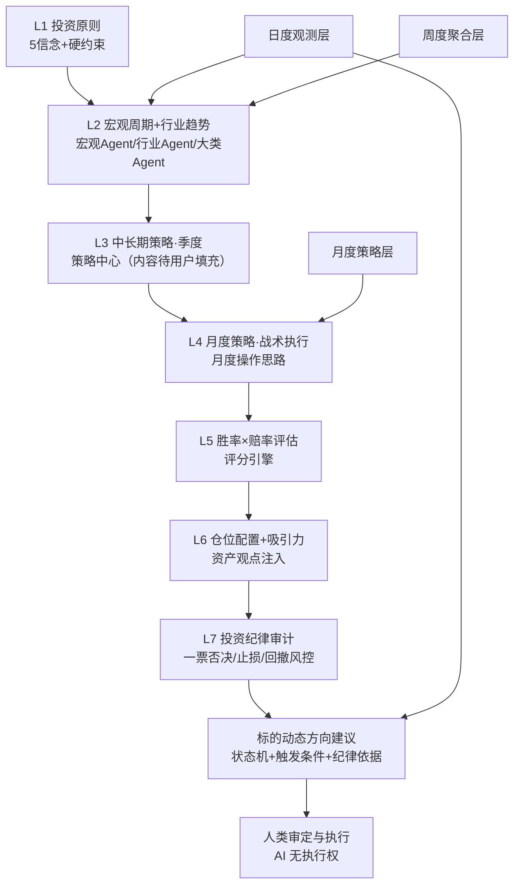

# 应用逻辑完善设计文档（认知投资工作台 · 改造蓝图）

> 版本：v0.1（蓝图）
> 日期：2026-08-28
> 定位：供 code agent 直接实现的改造蓝图。以《个人投资体系总纲-人机共创融合版》为规则源，以现有 Vite+React 前端 + 8 个 Agent（协调+7 垂直）+ 行情数据底座为改造基底。
> 状态：本蓝图含用户已授权的 3 项方向性变更（§1.3）；其中投资策略（L3）内容层**留空**，待用户后续填充后启用。

---

## 1. 背景与目标

### 1.1 目标逻辑链路（一句话）

**投资决策 = 核心理念原则（L1）+ 经济社会运行现状（L2 宏观/行业）+ 投资策略（L3/L4）→ 胜率赔率评估（L5）→ 仓位配置（L6）→ 投资纪律审计（L7）→ 对每个标的输出"动态方向建议"（状态机 + 触发条件 + 纪律依据）。**

该链路由「日度观测 → 周度聚合 → 月度策略 → 季度定调」四层节奏驱动，AI 自动产出证据与草稿，人类负责审定与最终决策。

### 1.2 现状基线（已核对代码与文档，改造前无需重做）

| 模块 | 现状 | 落点 |
| :--- | :--- | :--- |
| L1 投资原则 | ✅ 已完成 | 总纲 §1/§15.2；`PrincipleL1.jsx`、`PrincipleIS.jsx` |
| L2 宏观+行业 | ✅ 已建成 | 宏观周期/行业景气 Agent；梅林时钟连续定位 `MerrillClock.jsx`；MCP 数据底座 |
| L3/L4 策略中心 | 🔶 壳已存在，内容待填 | `StrategyCenter.jsx`（L3 五要素 + L4 monthlyStrategies 表） |
| L5/L6 评分引擎 | 🔶 壳已存在 | `ScoreEngine.jsx`（胜率 5 维 + 赔率 4 维 + 仓位矩阵） |
| 行业观察状态机 | 🔶 规则已定义，未实体化 | `IndustryWatch.jsx`；总纲 §14.4 |
| 实时行情 | ✅ 已打通 | `lib/quotes.js`（东方财富/腾讯 CORS 直连） |
| 7 垂类分析 | ✅ 已打通 | `lib/analysis.js`（TTL：标的 6h / 宏观 30 天，GitHub 同步 `analysis-cache.json`） |
| Agent 集群 | ✅ 已实体化 | 8 个 WorkBuddy Expert + `agents/*.md` 规范原文 |
| 交易执行 | ✅ 仅人工录入 | `TradeLogL4.jsx`，AI 无执行权（保持） |

### 1.3 本轮授权变更（改造的边界条件）

| # | 变更 | 说明 |
| :--- | :--- | :--- |
| **A1** | **垂直 Agent 输出约束放宽** | 允许 Agent 输出**买卖 / 仓位指令（建议级）**，但**禁止自动执行**、禁止绕过人下单；**最终决策权始终在人**。详见 §3.1。 |
| **A2** | **大类资产方向性思路的动态调整机制** | 人类可将对大类资产的方向性观点录入工作台，并可**与 AI 互动逐步调整**；AI 负责数据校验、冲突提示、区间约束，人类保留方向裁决权。详见 §3.2。 |
| **A3** | **投资策略（L3）内容层留空** | 策略中心 schema、UI、派生逻辑先行落地，策略内容暂空；用户后续提供素材后填充启用，无需改代码。 |
| A4 | 其余全部按"应用逻辑完善"基线建议落地 | 日/周/月节奏、标的动态方向建议状态机、触发条件、自动化编排、数据流闭环（§3.4–§3.6）。 |

> ⚠️ 注意：A1 是对《总纲》第十二章 §12.2/§12.5「禁止输出确定性买卖指令 / 专家禁出买卖仓位指令」执行口径的**工作台侧授权放宽**（仍保留"人最终决策、AI 无执行权"）。本蓝图按新口径实现；是否同步修订总纲原文文档，由用户另行决定（见 §9 开放项）。

---

## 2. 目标架构

### 2.1 决策链路（七层漏斗 + 节奏层）



### 2.2 三层金字塔数据流（节奏与闭环）

```
L3 季度定调 ──派生──▶ L4 月度策略（含"本月观测点 + 触发条件"）
      ▲                                │
      │                                ▼
 季度复盘 ◀── 月度复盘 ◀── 周度聚合 ◀── 日度观测（监控触发条件）
```

- **日度（自动）**：行情/估值分位/资金流/事件 → 触发条件监控 → 标的动态方向建议的**状态迁移提示**（仅触发时变更，否则"维持/观察"）。
- **周度（AI 草稿 + 人审定）**：聚合日度数据 → 行业趋势状态更新 + 持仓健康检查 + L7 合规审计。
- **月度（AI 草稿 + 人审定）**：L2 月度快照 →（L3 有内容后）派生 L4 月度操作思路 → 输出"本月观测点 + 触发条件"反向喂给日度监控。
- **季度（人主导 + AI 辅助）**：L3 定调、大类配置中枢调整、周期复盘。

### 2.3 权力边界（修订后，全局铁律）

| 角色 | 可以做什么 | 不可以做什么 |
| :--- | :--- | :--- |
| 垂直 Agent | 输出本领域事实/指标/局部判断；**输出买卖/仓位方向的建议**（含理由、置信度、本领域纪律校验） | 不自动执行任何操作；不跨领域调度；不替人确认 |
| 协调 Agent | 汇总各 Agent 建议 → L1–L7 校验 → 冲突消解 → 输出**综合建议**（方向 + 参考仓位区间 + 纪律结论 + 触发条件） | 不自动下单；不绕过人执行；不编造总纲外的仓位数值 |
| 人类 | 审定建议、确认/否决方向、最终执行、冲突裁决、体系迭代 | —— |
| 工作台/前端 | 展示建议与证据、人工录入交易、状态记录 | 任何"执行"动作必须经人工触发（交易页保持"仅人工录入"） |

> 关键差异（相对旧口径）：从"Agent 禁出买卖/仓位指令"改为"**Agent 可出买卖/仓位建议，但无执行权**"。建议带【置信度】【纪律依据】【触发条件】，落到"状态迁移提示"，不自动变更持仓。

---

## 3. 变更点明细

### 3.1 C1 · 垂直 Agent 输出约束放宽

**目标**：每个垂直 Agent 在原有六段式输出之上，新增【方向建议】段；协调 Agent 汇总后输出综合建议。

**① 垂直 Agent 输出结构（扩展）**

```text
【观测事实】【指标集合】【本领域局部判断】
【方向建议】（新增）
  - direction: 买入建议 / 加仓候选 / 持有维持 / 减仓预警 / 止损触发 / 一票否决拦截
  - suggestedPosition: { min, max }   // 本领域视角下的参考仓位区间（%），仅建议
  - reasoning: 依据（本领域证据 → 方向推导）
  - confidence: 0-100
  - disciplineCheck: 本领域纪律校验结果（如止损线是否触发、合规是否否决）
【置信度0-100】【局限性】【风险提示】
```

**② 协调 Agent 综合逻辑（扩展）**

1. 收集各垂直 Agent 的【方向建议】；
2. 执行 L1 原则校验 → L2 宏观/行业约束 → L5 胜率赔率打分 → L6 仓位矩阵（与总纲 §7/§15.6 硬约束取小值）→ L7 纪律审计；
3. 冲突消解优先级不变：**合规风控否决 > 财报负面 > 情绪/技术信号**；技术信号不得脱离基本面单独生效；逆向须财报+情绪双重正向证据；
4. 输出【综合建议】：方向（含加权来源）、参考仓位区间、纪律结论、触发条件、置信度、冲突清单；
5. **任何建议不自动执行**；只有人类确认后才进入"已决策/已执行"状态。

**③ 需同步修订的文件清单（code agent 必须一并更新）**

| 文件 | 修订点 |
| :--- | :--- |
| `agents/orchestrator.md` | 硬约束第 3 条/第 5 条、系统设定"禁止行为"段：改为"可输出买卖/仓位**建议**，禁止自动执行" |
| `agents/*.md`（7 个垂直 Agent） | 固定输出结构增加【方向建议】段；边界约束从"禁止输出买卖/仓位"改为"可给建议，无执行权" |
| `agents/_总纲边界摘要.md` | §12 执行口径更新为 A1 新口径；保留"无执行权、人最终决策" |
| `agents/README.md` | 全局通用规则更新 |
| `src/pages/AiProtocol.jsx` | 人机权责文案更新（"AI 可给方向建议、人拍板执行"） |
| `src/layout/DisclaimerBar.jsx` / 交易页 `BoundaryAlert` | 文案保持"AI 无执行权"，补充"建议仅供参考、人最终决策" |
| `src/lib/analysis.js` `VERTICAL_BRIEF` | 提示词增加"可给出方向建议，不得自动执行" |

### 3.2 C2 · 大类资产方向性思路的动态调整机制

**目标**：人类可将大类资产方向性观点录入，并可与 AI 互动逐步调整；AI 做数据校验、冲突提示、区间约束，方向裁决权在人。

**① 新增数据实体 `assetViews`（资产观点）**

```js
{
  id: string;                    // AV-YYYY-NNN
  assetClass: '权益'|'债券'|'黄金'|'现金'|'红利'|'成长'|'其他';  // 大类或细分
  direction: '超配'|'标配'|'低配';
  rationale: string;             // 人类观点依据
  strength: 0-100;               // 观点强度（权重）
  source: 'human'|'ai-draft'|'ai-adjusted';   // 来源
  status: '生效'|'待确认'|'已失效';
  linkedPhase: string;           // 关联的周期阶段（复苏/过热/滞胀/衰退末期），可为空
  aiCheck: {                     // AI 校验结果（每次调整时刷新）
    dataEvidence: string;        // 数据面证据（估值分位/资金流/趋势）
    systemRange: {min,max};      // 总纲 §7.1 允许区间
    conflict: string[];          // 与数据/总纲的冲突点
  };
  updatedAt: string;
}
```

**② 两种录入/调整路径**

- **路径 A（直接录入）**：人在"资产观点"面板直接记录方向 + 依据；AI 自动校验并显示"人观点 vs 数据证据 vs 总纲区间"三方对照，提示冲突但**不阻止录入**。
- **路径 B（对话调整）**：在 Chat 中表达"我想超配黄金/低配债券"，AI 检索对应资产数据与总纲区间，输出论证与冲突提示，人确认后写入 `assetViews`（source 标记 `ai-draft` 或 `ai-adjusted`）。

**③ 注入与生效**

- `assetViews` 注入宏观周期 Agent / 大类资产配置辅助 Agent 的 L6 计算：在**总纲 §7.1 区间内**作为"人类方向性修正"调整建议中枢（如"超配黄金"→ 在 5%–25% 区间内取偏上）。
- 当人观点与总纲区间冲突（如"黄金超配到 40%"）时：AI 标记冲突、给出替代建议，**不强行执行**，交人裁决。
- 复用/泛化现有梅林时钟 `posSource=manual` 逻辑：手动调整后 AI 不覆盖，尊重人工研判。
- 所有调整记录 `updatedAt` 与来源，纳入周/月复盘溯源。

**④ 建议落点**：扩展 `components/dashboard/AssetAttractiveness.jsx`（或新增 `AssetViews.jsx` 面板）；store 新增 `assetViews` slice。

### 3.3 C3 · 投资策略（L3）内容层留空

**目标**：策略中心 schema、UI、L4 派生依赖逻辑先行落地；策略内容暂空，用户后续填充即启用，无需改代码。

- L3 策略 schema **沿用总纲 §15.4.1 五要素**：宏观基调 / 大类配置基调（目标中枢）/ 行业配置主线（超配-标配-低配）/ 策略风格侧重 / 核心假设（3–5 条，证伪即失效）。
- `StrategyCenter.jsx`：保留完整新建/编辑能力；空态提示"策略内容待用户填充"；策略 `status` 含"草稿/已审定/执行中/已失效"。
- **L4 派生依赖处理**：月度策略生成流程设计为"有 L3 → 自动派生草稿；无 L3 → 进入待定态，仅输出 L2 月度快照 + 待办提示"，不阻塞日/周节奏。
- 用户后续填充策略时：仅录入内容，不涉及代码改动（若需要，可附策略 → 能力圈/选股标准映射关系，见 §9）。

### 3.4 C4 · 日/周/月节奏与自动调度

**① 新增三层报告数据实体**

```js
// 日度市场动态简报（DailyBrief）
{
  id: string; date: string;
  macro: { phase, confidence, keyIndicators[] };          // 复用宏观快照
  market: { indices[{name,px,chg}], breadth, fundFlow };  // 指数/广度/资金
  events: [{source,title,impact,relatedTargets[]}];       // 当日事件
  triggered: [{targetId, condition, action}];             // 触发条件命中列表（核心）
  updatedAt: string;
}
// 周度投资分析（WeeklyReport）
{
  id: string; weekStart: string; weekEnd: string;
  industryTrends: [{industry, trendState, score, change}];  // §14.4 状态更新
  holdingHealth: [{targetId, health, alerts[]}];            // 持仓健康
  l7Audit: { violations[], riskLevel };                     // 纪律审计
  actionItems: string[];  // 待人类处理事项
}
// 月度操作思路（MonthlyBrief = L4 草稿）
{
  id: string; month: string;
  observationPoints: string[];       // 本月验证假设的观测指标（反向喂日度）
  triggers: [{targetId, condition, targetState}];  // 本月触发条件
  plan: { assetClass[], industry[], targets[], cadence, riskPlan };
  status: '待审定'|'已审定'|'已失效';
}
```

**② 调度任务（定时）**

| 任务 | 频率 | 触发时间 | 产出 | 输入 |
| :--- | :--- | :--- | :--- | :--- |
| 日度市场动态简报 | 每个交易日 | 收盘后（如 16:00） | DailyBrief + 标的动态方向建议状态刷新 | 行情/资金流/事件/触发条件 |
| 周度投资分析 | 每周五收盘后 | 盘后 | WeeklyReport | 本周日度数据聚合 + 持仓 + L7 |
| 月度操作思路 | 每月末 | 末交易日盘后 | MonthlyBrief（L4 草稿） | L2 月度快照 +（有 L3 时）派生 |

- 实现方式（code agent 二选一，建议 A）：
  - **A（推荐，契合现有架构）**：新增无头调度脚本（如 `scripts/scheduler.mjs`）复用 `quotes.js + deepseek.js + knowledge.js` 管线，把结果写入 store 结构与 GitHub `analysis-cache.json`；由 agent 运行时定时任务（cron）触发。
  - **B**：前端保留"打开即分析"（现有 analysis.js 逻辑），报告以"最近生成时间 + 手动刷新"呈现；定时能力后置。
- **标的行情缓存 TTL**：从 6 小时收短至"当日有效，收盘后刷新"（`lib/analysis.js` 的 `TTL.target` 调整），宏观 TTL 保持 30 天。

### 3.5 C5 · 标的动态方向建议状态机

**目标**：把"对每个标的的动态方向建议"从"每天临时拍方向"升级为"状态机 + 触发条件 + 纪律依据"，稳定、可审计、抗短期噪音。

**① 状态机（沿用总纲 §14.4）**

```
待观察 → 趋势确认 → 择时入场 → 已入场 → 已放弃
   ↑          ↑          │          │
   └──────────┴──────────┴──────────┘（任何环节可流转到已放弃）
```

**② 新增数据实体 `targetStates`（标的动态方向建议）**

```js
{
  id: string; targetId: string; targetName: string; code: string;
  state: '待观察'|'趋势确认'|'择时入场'|'已入场'|'已放弃';
  prevState: string;
  direction: '买入建议'|'加仓候选'|'持有维持'|'减仓预警'|'止损触发'|'一票否决拦截';
  directionReason: string;              // 由哪些 Agent 证据/综合建议构成
  triggers: [{ condition, lastCheck, status }];   // 触发条件（来自 L4 月度 + 总纲止损/止盈）
  discipline: {                          // 纪律校验快照
    l7Pass: boolean; violation?: string;
    stopLossHit?: boolean; drawdownRisk?: 'green'|'amber'|'red';
    positionLimit: {min,max};            // 总纲 §7 参考区间
  };
  agentVotes: [{ agent, direction, confidence }]; // 各 Agent 方向建议快照
  confidence: 0-100;
  updatedAt: string; updatedBy: 'auto'|'human-confirmed';
}
```

**③ 更新规则（关键：日频只动"触发"，不轻易动"方向"）**

- 日度自动更新：只刷新行情/估值/资金流与 `triggers` 状态；**仅在以下三种情况下发生状态迁移**：
  1. 命中触发条件（买入/止损/止盈/加仓/减仓线）；
  2. 出现新一票否决风险（合规 Agent 命中 → 直接 `一票否决拦截`）；
  3. 宏观/行业趋势状态变化（周度聚合结果驱动）。
- 其余情况一律输出"持有维持/观察"，不因单日波动改变方向。
- 人类确认后 `updatedBy = 'human-confirmed'`；AI 自动迁移必须标记 `auto` 并保留 prevState 便于回溯。

### 3.6 C6 · 数据流闭环（假设/触发条件反向喂入）

- L3/L4 产出的"核心假设 + 本月观测点 + 触发条件"**结构化回写**，成为日度监控的输入；
- 日度 `triggered` 命中 → 周度聚合 → 月度复盘对照"假设是否被证伪"（证伪即策略失效，§15.4.1）；
- 复盘结论回写体系变更日志（`SystemChangeLog`），支撑季度 L3 调整；
- 全链路保留溯源：每条方向建议标注来源 Agent、原始依据、置信度（总纲 §12.2 弱预测/可溯源原则）。

---

## 4. 数据模型变更（store 层）

在 `src/store/useStore.js` / `src/models/schemas.js` 新增以下 slices（沿用现有 Zustand persist + localStorage + GitHub 同步模式）：

| slice | 实体 | 说明 |
| :--- | :--- | :--- |
| `assetViews` | 资产观点 | §3.2 字段 |
| `targetStates` | 标的动态方向建议 | §3.5 字段 |
| `dailyBriefs` | 日度简报 | §3.4 字段 |
| `weeklyReports` | 周度分析 | §3.4 字段 |
| `monthlyBriefs` | 月度操作思路 | §3.4 字段（可与现有 `monthlyStrategies` 合并或扩展） |

> 现有 `strategies`（L3）、`monthlyStrategies`（L4）、`scoreCards`（L5/L6）、`industryWatch`（行业观察）沿用；L3 内容保持空。

---

## 5. 前端页面 / 组件变更

| 变更 | 文件 | 说明 |
| :--- | :--- | :--- |
| 新增 | `pages/DailyBrief.jsx` | 日度市场动态简报（宏观/指数/事件/触发命中列表） |
| 新增 | `pages/WeeklyReport.jsx` | 周度投资分析（行业趋势/持仓健康/L7 审计/待办） |
| 新增 | `pages/MonthlyBrief.jsx` | 月度操作思路（观测点/触发条件/计划，含待审定态） |
| 新增 | `pages/AssetViews.jsx` 或扩展 `AssetAttractiveness.jsx` | 资产观点管理（三方对照：人观点 vs 数据 vs 总纲区间） |
| 扩展 | `pages/TargetL3.jsx` / 持仓页 | 标的"动态方向建议"卡片（状态机 + 触发条件 + 纪律依据 + Agent 投票） |
| 扩展 | `pages/StrategyCenter.jsx` | L3 空态占位 + L4 派生状态 |
| 扩展 | `pages/Chat.jsx` | 资产观点对话调整入口（路径 B） |
| 修改 | `pages/AiProtocol.jsx`、`DisclaimerBar.jsx`、`BoundaryAlert.jsx` | 权力边界文案（A1 新口径） |
| 修改 | `lib/analysis.js` | TTL.target 收短；`VERTICAL_BRIEF` 增加方向建议 |
| 新增 | `scripts/scheduler.mjs`（建议） | 无头调度管线（日/周/月） |
| 新增 | `src/utils/direction.js` | 状态机迁移判断、触发条件匹配、纪律校验聚合 |

---

## 6. 调度与运行环境

- 建议采用「agent 运行时定时任务（cron）+ 无头脚本」组合：脚本复用现有前端 lib（quotes/deepseek/knowledge），产物写入 `analysis-cache.json`（GitHub 同步机制已有）。
- 定时任务表见 §3.4 ②；非交易日（周末/节假日）日度任务跳过或降级为"休市快照"。
- 报告在打开工作台时读取最近一份并展示"生成时间"；过期提示手动刷新。

---

## 7. 实施路线（依赖排序）

**P0（必须先做）**
- C1：Agent 输出约束放宽（8 个 Agent 文件 + 前端提示词 + 文案同步修订）
- C2：`assetViews` 数据实体 + 资产观点面板 + 对话调整入口 + 注入 L6
- C3：L3 空态占位与 L4 派生依赖处理

**P1**
- C5：`targetStates` 状态机 + 触发条件 schema + 动态方向建议卡片（复用 §14.4 状态流转 + §7/§9 纪律规则）
- C4 前半：日度简报（DailyBrief）+ 标的行情 TTL 收短

**P2**
- C4 后半：周度分析（WeeklyReport）+ 月度操作思路（MonthlyBrief）生成流程
- C6：假设/触发条件反向喂入 + 月度复盘对照

**P3**
- `scripts/scheduler.mjs` + cron 定时任务编排
- 全链路溯源与验收自检

---

## 8. 验收标准

1. 垂直 Agent 输出含【方向建议】段且无任何自动执行路径；交易页仍"仅人工录入"。
2. `assetViews` 可录入/对话调整/显示三方对照；与总纲区间冲突时标记冲突且不越权执行。
3. L3 策略为空时不阻塞日/周节奏，填充后 L4 可自动派生草稿。
4. 日度简报、周度分析、月度思路按节奏产出（或待定时任务启用后自动产出）。
5. 每个跟踪/持仓标的有 `targetStates`：含状态、触发条件、纪律快照、Agent 投票、置信度、更新时间与来源。
6. 日频更新不产生方向漂移（无触发不迁移状态）；所有结论带置信度/局限性/溯源。
7. 前端各页可打开、无报错（构建 + 浏览器实测）。

---

## 9. 待办 / 开放项（交用户后续决定）

1. **L3 投资策略内容**：用户整理后提供（策略名称/适用环境/对应选股标准/适配池/触发失效条件），填充即启用。
2. **大类资产方向性观点明细**：用户后续在工作中与 AI 互动逐步补充（§3.2 机制已就绪）。
3. **是否同步修订总纲第十二章原文**：A1 为工作台侧口径；总纲文档是否同步改由用户决定。
4. **交易页文案口径**：A1 后"AI 无交易决策权"是否保留/改写（本蓝图建议保留"无执行权"）。
